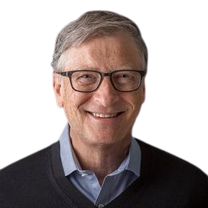

# Portfólio de William Henry Gates III

Bem-vindo ao meu portfólio fictício dedicado a William Henry Gates III, o renomado empresário, desenvolvedor e filantropo. Este projeto foi criado como parte dos meus estudos de front-end para destacar minhas habilidades e projetos.

## Sobre Bill Gates

Bill Gates é co-fundador da Microsoft Corporation, uma das maiores empresas de tecnologia do mundo. Além de sua contribuição para a revolução da computação pessoal, Gates é conhecido por seu trabalho humanitário através da Fundação Bill e Melinda Gates, focada em questões globais de saúde, educação e desenvolvimento.

## Objetivo do Portfólio

Este portfólio fictício visa mostrar meu domínio de tecnologias front-end, incluindo HTML, CSS e JavaScript, enquanto presto homenagem a uma figura influente como Bill Gates.

## Projetos Destacados

### Projeto 1: Acessibility Insights
- **Descrição:** Uma suite de ferramentas open source para auxiliar os desenvolvedores a encontrar e corrigir problemas de acessibilidade em apps Web, Android e Windows.
- **Link:** [Acessibility Insights](https://accessibilityinsights.io/)

### Projeto 2: Azure SDK
- **Descrição:** Os SDKs do Azure são um conjunto de bibliotecas focadas em garantir que os desenvolvedores ao redor do mundo tenham uma experiência de primeira classe ao aproveitar os serviços do Azure em suas aplicações.
- **Link:** [Azure SDK](https://github.com/azure/azure-sdk)

### Projeto 3: Blazor
- **Descrição:** Blazor permite que você construa interfaces de usuário web interativas usando C# em vez de JavaScript.
- **Link:** [Blazor](https://dotnet.microsoft.com/pt-br/apps/aspnet/web-apps/blazor)

## Como Contribuir

Sinta-se à vontade para explorar os projetos, sugerir melhorias ou contribuir com novas funcionalidades. Basta fazer um fork do repositório, fazer as alterações e enviar um pull request.

## Autor

Este portfólio foi criado por João Elias Ferraz Santana, como parte de seus estudos de front-end.
